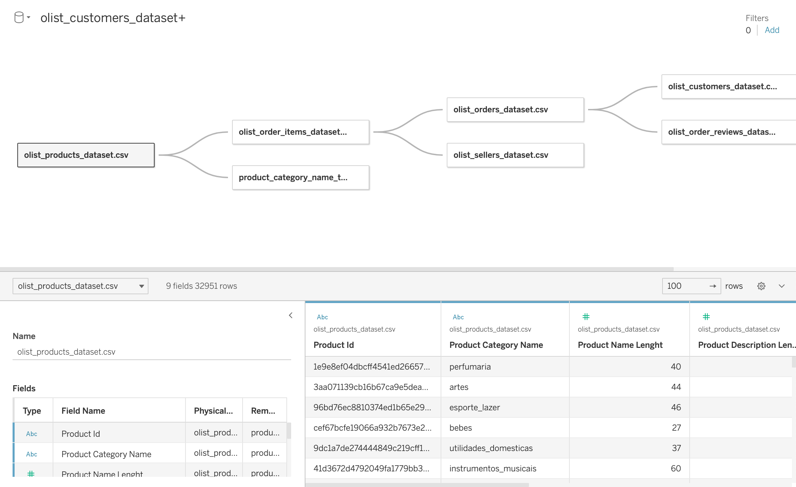
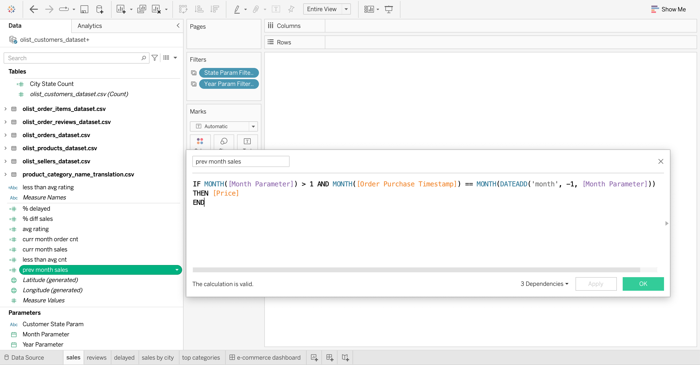
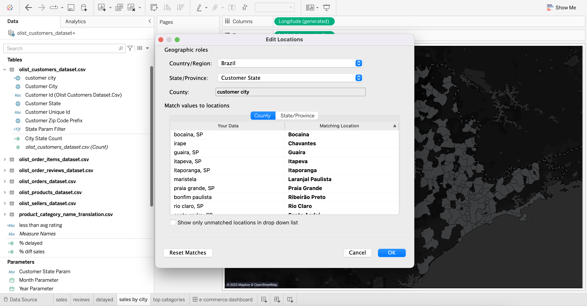
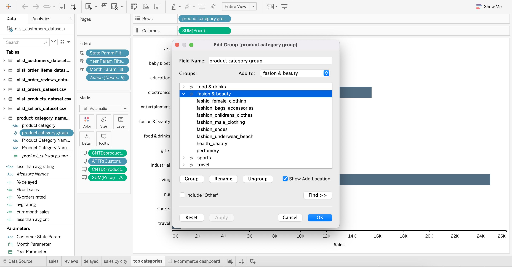
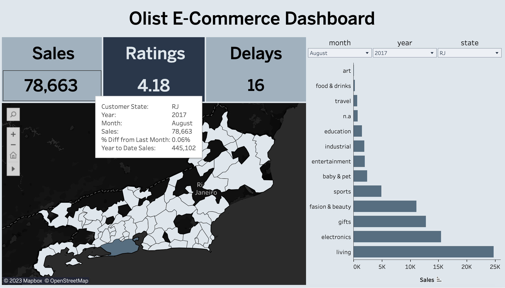
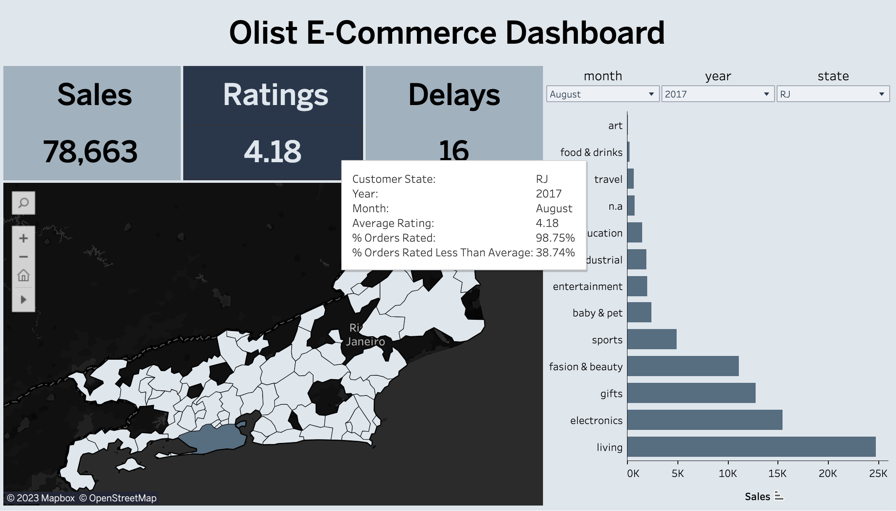
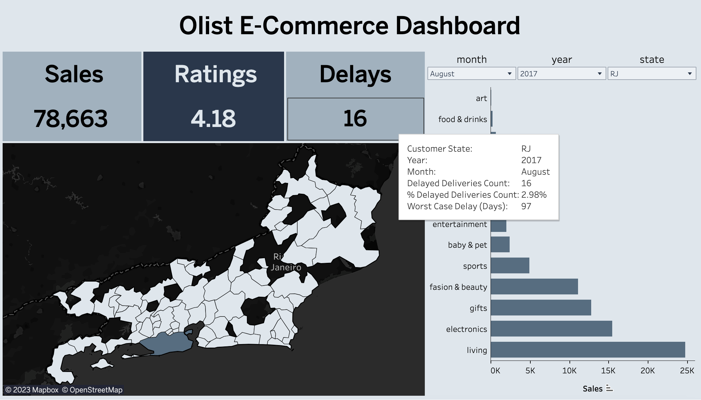
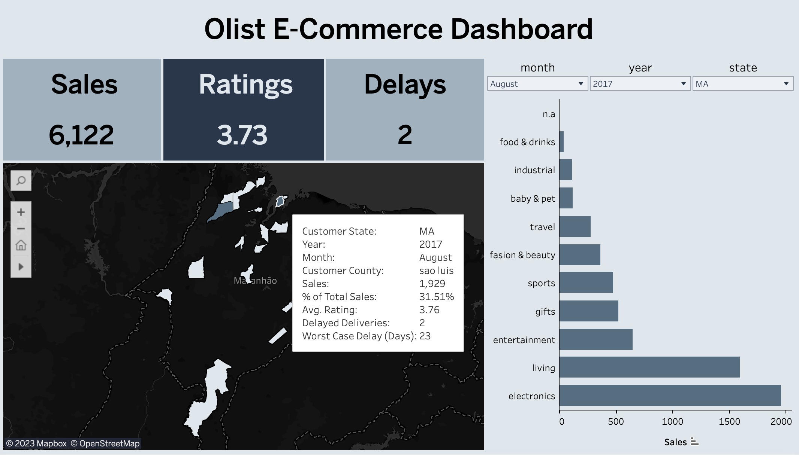
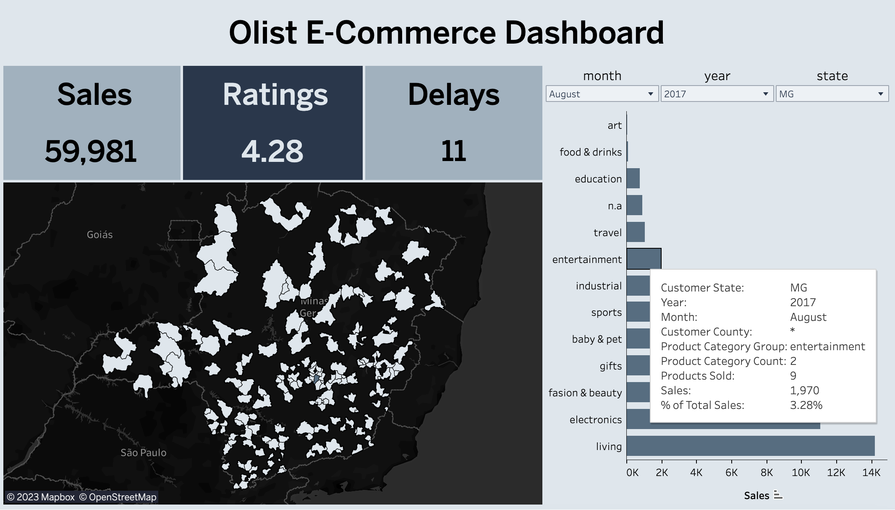
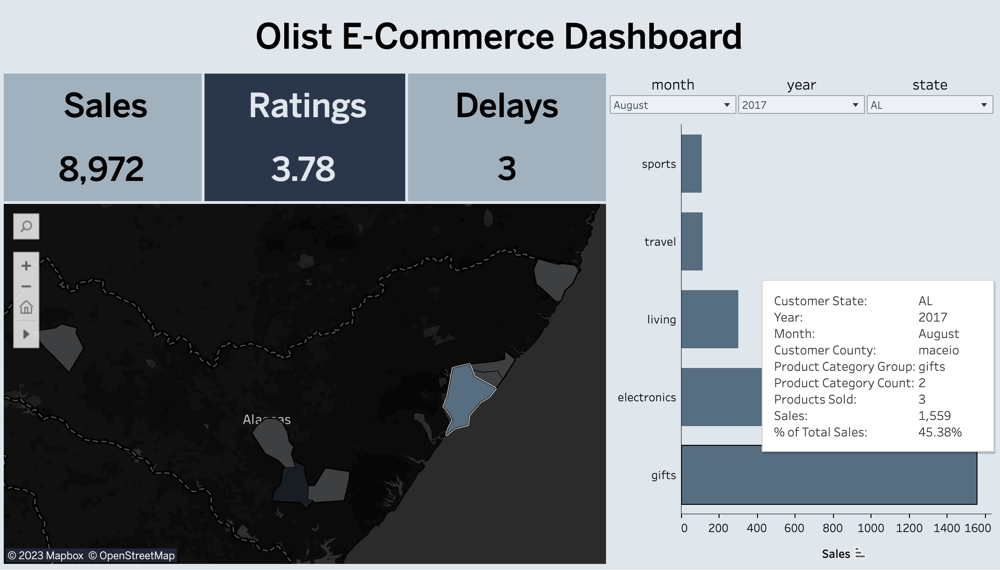

# 💸 olist dashboard
summary of e-commerce revenue, customer satisfaction and delivery service as tableau [dashboard](https://public.tableau.com/views/OlistDashboard_16876242836040/e-commercedashboard?:language=en-US&:sid=&:display_count=n&:origin=viz_share_link)

### Data Preparation

1. join CSV data according to [table relationships](https://i.imgur.com/HRhd2Y0.png) defined in data source to get complete set of attributes from normalized data

2. define calculation such as difference in sales from previous month, percent of orders rated less than average rating and etc. to derive additional metrics beyond current filter

3. mapp customer locations to county names available in Tableau for data consistency in terms of geographic level and to  visualize locations as area which is easy to comprehend

4. group product category names to reduce cardinality of the categories and to increase user friendliness of dashboard

### Data Visualization

1. create order year, order month and customer state parameters to use for data filtering
2. visualize sales accompanied with year to date sales and difference in sales from last calendar month for comparison

3. display average of order ratings, percent of orders rated and percent of orders rated less than the average to provide overview of customer satisfaction, customer feedback rate and proportion of orders perceived as dissatisfactory than average

4. summarize delayed order deliveries in terms of count, proportion and worst case to highlight if improvements are required in delivery service since it also impacts customer satisfaction

5. visualize contribution of county sales to state level revenue and summarizing a subset of state level measures for each county

6. represent sales by product category group using bar chart to highlight top selling group for filtered location

7. create action that is triggered upon clicking a county in map to summarize revenue by product category for the county

